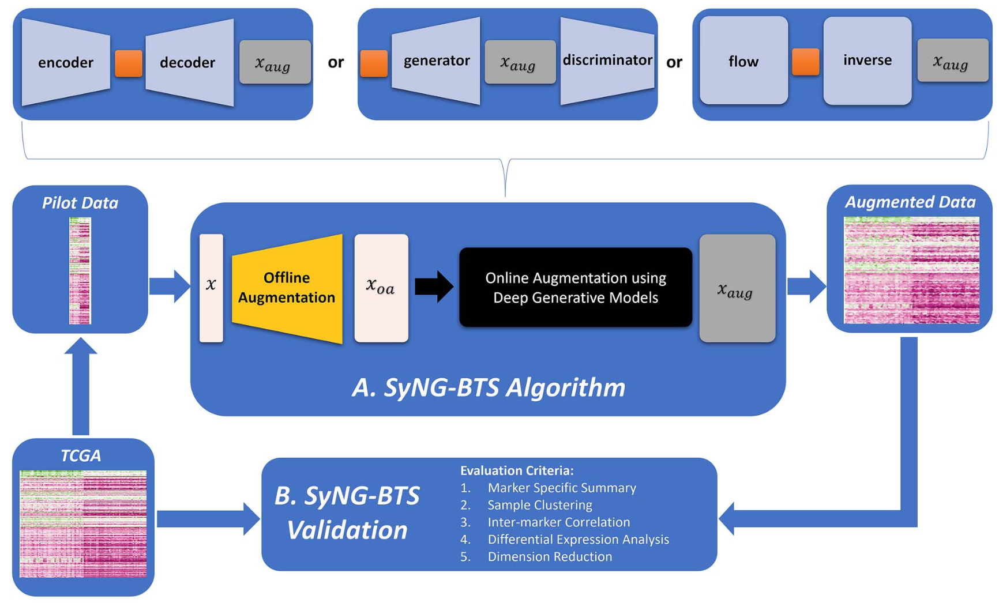
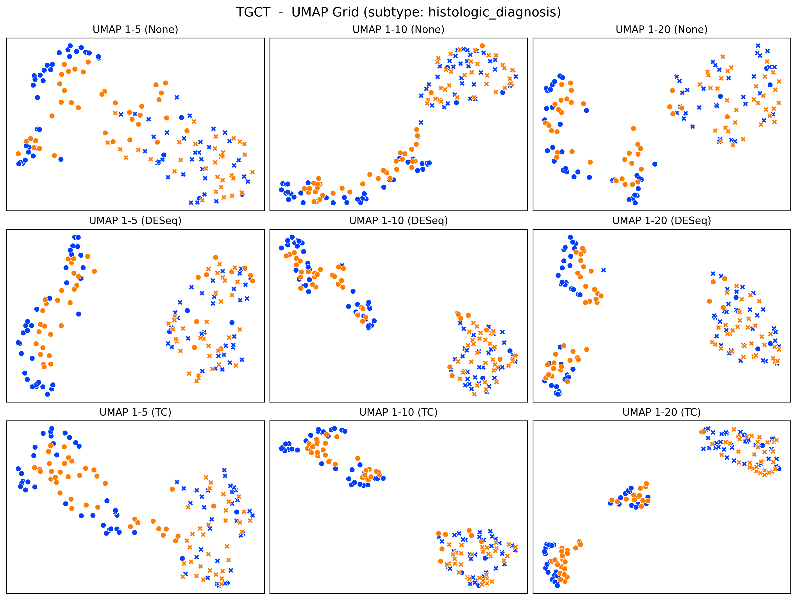
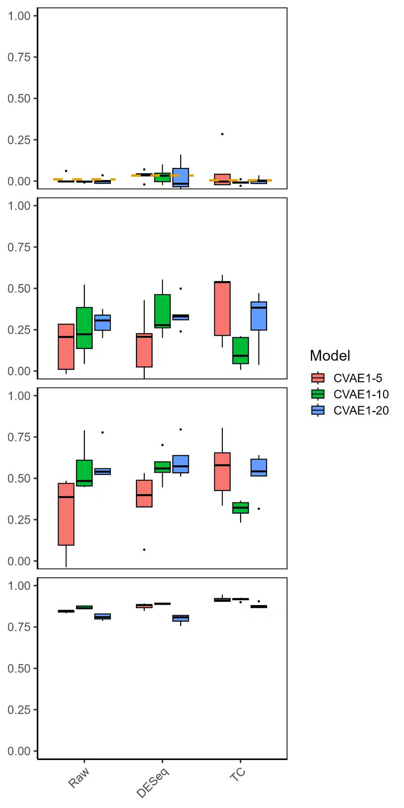

# SyNG‑BTS — Demo Repository (MSK Project)

> **Goal**: Provide a public‑safe overview of my implementation & debugging work on **SyNG‑BTS**, a data augmentation pipeline for RNA/miRNA‑seq that combines **offline** (statistical/AE) and **online** (deep generative) augmentation. This demo shares workflow diagrams and example plots without exposing restricted data/code.

---

## 1) What is SyNG‑BTS?

**Sy**nthetic **N**ext‑**G**eneration augmentation for **B**ulk **T**ranscriptomic **S**equencing (SyNG‑BTS) aims to boost downstream analyses (clustering, DE, embedding) by enriching limited cohorts with realistic synthetic samples.

### Key ideas

* **Two‑stage augmentation**

  * **Offline augmentation**: fast transformations trained once per dataset (e.g., **Gaussian sampling around denoised centroids**, **Autoencoder** latent perturbations) to produce $x_{oa}$.
  * **Online augmentation**: **CVAE**/**GAN**/**flow** models that sample conditionally during training/inference to produce $x_{aug}$.
* **Normalization choices**: compare **None**, **DESeq** size‑factor scaling, and **TC** (total count) normalization, plus optional log transforms.
* **Model grid**: swap models & hyper‑parameters (e.g., latent dims 5/10/20; KL/β for CVAE; GAN generator depth) and evaluate cross‑cancer transfer.
* **Evaluation**: multiple metrics that probe structure preservation and DE signal concordance (details in §4).

---

## 2) Workflow (Figure 1)

**Reading the diagram**

1. **Input/pilot data** (optionally expanded with TCGA cohorts) → **Offline augmentation** generates $x_{oa}$.
2. **Online augmentation** (deep generative models) samples $x_{aug}$ conditioned on class/covariates.
3. **Augmented dataset** = $x \\cup x_{oa} \\cup x_{aug}$.
4. **Validation suite** applies metrics including clustering alignment and DE concordance to decide which settings generalize best.

---

## 3) Example Augmented Embeddings — TGCT (Figure 2)

* **Panels**: a 3×3 grid varying **latent dimensions** (1–5, 1–10, 1–20) × **normalization** (None, DESeq, TC).
* **Color**: original vs augmented samples.
* **Markers**: group 1 vs group 0
* **Goal**: visually check whether augmentation **respects manifold structure** and preserves subtype separability across preprocessing choices.

---

## 4) Quantitative Metrics (Figure 3)

We report four metrics from top to bottom:

1. **ARI** — Adjusted Rand Index for clustering assignments of (original + augmented) samples vs. known subtypes. Lower is better (1 = greatly separated; 0 ≈ perfect grouped).
2. **ccc_pos** — **Concordance Correlation Coefficient** between original and augmented **marker‑positivity** summaries (binary/thresholded calls per gene/miRNA).
3. **ccc_log2FC** — CCC between original and augmented **log2 fold‑changes** from DE analysis.
4. **ccc_log10pvalue** — CCC between original and augmented **−log10 p‑values** from DE tests.

> **CCC formula** (Lin):

$$
\\rho_c = \\frac{2\\rho\\,\\sigma_x\\sigma_y}{\\sigma_x^2 + \\sigma_y^2 + (\\mu_x - \\mu_y)^2}
$$

Values approach 1 for perfect concordance. We compute CCC across features within each model/normalization setting.

---

## 5) What I implemented/debugged in this demo

* **Offline augmentation**: AE denoising + latent Gaussian perturbation; Gaussian sampling around class‑conditioned centroids; parameter sweep (σ, latent dims).
* **Online augmentation**: CVAE training loop with configurable β (KL weight), conditional vectors, and temperature‑scaled sampling; plug‑in stub for GAN.
* **Evaluation suite**: UMAP grids, ARI/CCC metric calculators, and cross‑normalization comparisons.
* **Reproducibility**: fixed seeds, split bookkeeping, and saving of config + metrics for each run.

---

## 6) Contact

* **Author**: Yanjie Chen ([yc4594@columbia.edu](mailto:yc4594@columbia.edu))
* **Issues / Questions**: please open a GitHub issue in this repo.

---

Timeline: The manuscript and code are expected to be released in **Aug 2026**.
